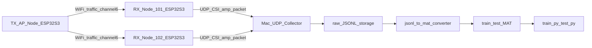

# WiSLAR CSI 프로젝트 중간개발보고서 (2026-04-27)

## 1. 서론

### 1.1 과제 배경 및 필요성
- 본 과제는 3m x 3m 실내 공간에서 Wi-Fi CSI(Channel State Information)를 활용해 인체 움직임을 감지하는 시스템을 구축하는 것을 목표로 한다.
- 기존 카메라 기반 인식은 프라이버시 이슈와 조도 의존성이 크고, 웨어러블 기반은 사용자 착용 부담이 있다는 한계가 있다.
- 본 프로젝트는 ESP32-S3 다중 노드와 Mac 수집기를 활용해 비전/웨어러블 없이 RF 신호만으로 움직임 판단이 가능한 파이프라인을 구축한다는 점에서 차별성이 있다.

### 1.2 과제 목표
- 최종 결과물 목표:
  - TX/AP + RX 다중 노드 + Mac 수집기로 CSI 데이터 안정 수집
  - 수집 원본(JSONL)에서 학습용 `.mat` 생성
  - 이진 분류(움직임/비움직임) 모델 학습 및 평가
- 현재까지 확인된 성능 지표(실측):
  - 단일 RX(101) 수집 성공
  - 수집기 유실률 `drop_rate` 약 `0.02%` (최근 세션 로그 기준)
  - `missing_devices=[]`, `stale_devices=[]` 유지

---

## 2. 설계 및 구현 현황

### 2.1 시스템 아키텍처

- TX/AP 노드는 `WiSLAR_TX_AP`를 생성하고 heartbeat 트래픽을 송신한다.
- RX 노드는 CSI를 수집/전처리 후 UDP로 Mac 수집기에 전송한다.
- Mac 수집기는 세션 단위로 JSONL 저장 후 학습용 `.mat` 변환 파이프라인과 연결된다.

### 2.2 세부 설계 사항
- 데이터 저장 구조:
  - `mac_collector_output/raw/YYYYMMDD/session_<id>/device_<id>.jsonl`
  - 세션 메타 스냅샷: `session_meta_snapshot.yaml`
- 패킷/라벨/변환 설계:
  - UDP 패킷 스키마 기반으로 `session_id`, `device_id`, `seq`, `timestamp_us`, `csi_amp[]` 저장
  - `markers_to_labels.py`로 구간 라벨 생성 가능
  - `jsonl_to_mat.py`로 `train_data.mat`, `test_data.mat` 생성 가능
- 데이터셋 창 분할 기본값:
  - `window_size=192`, `stride=96`

### 2.3 현재 구현 범위
- 완료 모듈:
  - TX/AP 펌웨어: `esp32s3_tx_ap_node/main/tx_ap_main.c`
  - RX CSI 송신 펌웨어: `esp32s3_csi_sender/main/csi_sender_main.c`
  - Mac 수집기 MVP: `mac_collector/udp_collector_mvp.py`
  - 변환 스크립트: `data_tools/jsonl_to_mat.py`, `data_tools/markers_to_labels.py`
- 개발 스택:
  - ESP-IDF v5.2.2, Python 3, NumPy/SciPy, JSONL 기반 수집/저장

### 2.4 주요 소스코드/설계안 설명
- RX 핵심 로직:
  - Wi-Fi STA 연결 -> UDP 소켓 설정 -> CSI callback 등록 -> CSI amplitude 추출/전송
  - 최근 이슈였던 CSI 비활성 문제는 `sdkconfig`에서 CSI 옵션 활성화로 해결
- 수집기 핵심 로직:
  - 패킷 검증(`magic/version/len`) 후 `device_id`별 파일 append
  - `seq` 기반 누락 추정, `missing/stale` 상태 출력
- 변환기 핵심 로직:
  - JSONL 시계열 로드 -> 라벨 구간 적용 -> 윈도우 분할 -> MAT 키 포맷 저장

---

## 3. 진행도 분석

### 3.1 추진 일정 대비 실적
- 초기 단계(P0) 목표 대비:
  - 통신 스키마 확정: 완료
  - Mac 수집기 MVP: 완료
  - RX 1대 E2E: 완료
  - 5분 이상 실측 검증: 완료
- 정량 추정:
  - 전체 로드맵(P0~P2) 기준 약 `55~60%`
  - P0 기준 `90%+` 달성 (RX 다중화 및 학습 연결은 후속)

### 3.2 개발 환경 및 도구 활용
- 펌웨어: ESP-IDF(v5.2.2), `idf.py`, `esptool.py`
- 수집/변환: Python, JSONL, NumPy, SciPy
- 협업/형상관리: Git 저장소 기반 개발
- 문서화: `docs/` 내 체크리스트/설계/적용 가이드 유지

### 3.3 중간 결과물
- 실행 로그:
  - TX/AP 정상 기동 및 heartbeat 증가 확인
  - RX 정상 연결, `CSI enabled`, `UDP target` 정상 확인
- 산출 파일:
  - `mac_collector_output/raw/20260427/session_1/device_101.jsonl`
  - `mac_collector_output/raw/20260427/session_1/session_meta_snapshot.yaml`
- 최근 세션 요약(실측):
  - 패킷 수: 약 14,034 프레임(현 파일 기준)
  - 평균 RSSI: 약 `-28.9 dBm`
  - `seq` 기반 누락: `27/14061` 수준(약 `0.19%`, 로그 기준 구간별 `0.02~0.2%`)

---

## 4. 문제점 및 해결 방안

### 4.1 기술적 애로사항
- 수집기 무수신 문제:
  - RX 네트워크 대역(`192.168.4.x`)과 Mac 수집기 IP 설정 불일치
- RX 반복 재부팅 문제:
  - `CSI not enabled in menuconfig`로 `esp_wifi_set_csi_config` 실패
- 운영상 혼선:
  - 포트별 보드 역할(TX/AP vs RX) 혼동

### 4.2 해결 과정 및 계획
- 해결 완료:
  - MAC 주소 기반 포트-보드 역할 매핑 확정
  - `sdkconfig` CSI 옵션 활성화 후 RX 재플래시
  - collector IP를 실제 환경(`192.168.4.2`) 기준으로 반영 재빌드
- 후속 계획:
  - 세션 시작 전 `session_meta.yaml`과 런타임 IP 자동 검증 로직 추가
  - RX 다중화 시 장치 등록표 자동 검증 강화

### 4.3 설계 변경 사항
- 초기 문서 일부에서 TX/AP 미구현으로 분류됐으나, 실제 코드/실측 기준으로 TX/AP 동작 가능 상태로 정정 필요
- 운영 절차를 "네트워크 대역 일치 확인 -> RX/TX 역할 확인 -> 수집 시작" 순으로 강화

---

## 5. 향후 추진 계획

### 5.1 잔여 과업 목록
- RX 2대 동시 수집(101, 102) 및 유실률 비교
- 라벨링 CSV(`markers.csv`/`labels.csv`) 정식 작성
- `jsonl_to_mat.py` 실행으로 `train_data.mat`, `test_data.mat` 생성
- `train.py`/`test.py` 학습-평가 1회 완료
- 세션 메타 정합성 자동 검증 항목 보강

### 5.2 최종 일정 계획(안)
- 1주차:
  - RX 2대 동시 수집 안정화
  - 세션 프로토콜/라벨링 규칙 확정
- 2주차:
  - `.mat` 변환 및 1차 학습/평가
  - 에러 케이스 분석 및 파라미터 튜닝
- 3주차:
  - 다중 세션 재현성 검증
  - 전시/심사용 데모 시나리오 정리 및 문서 고도화

### 5.3 기대 효과 및 활용 방안
- 프라이버시 친화형 실내 움직임 감지 기술 검증
- 저비용(ESP32-S3) 다중 센서 기반 환경 모니터링 응용 가능
- 졸업전시/심사에서 실제 수집-학습 파이프라인 데모 가능

---

## 부록: 핵심 결과 경로
- 실측 데이터: `mac_collector_output/raw/20260427/session_1/device_101.jsonl`
- 세션 스냅샷: `mac_collector_output/raw/20260427/session_1/session_meta_snapshot.yaml`
- 주요 코드:
  - `esp32s3_tx_ap_node/main/tx_ap_main.c`
  - `esp32s3_csi_sender/main/csi_sender_main.c`
  - `mac_collector/udp_collector_mvp.py`
  - `data_tools/jsonl_to_mat.py`
