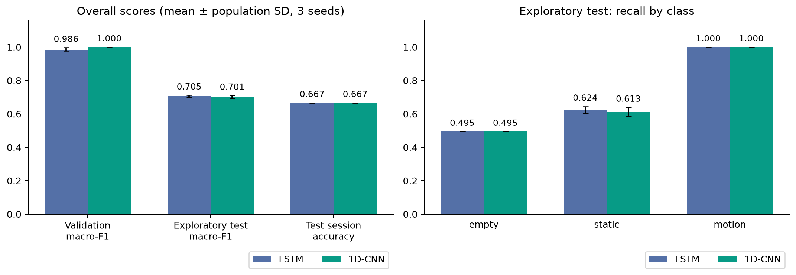
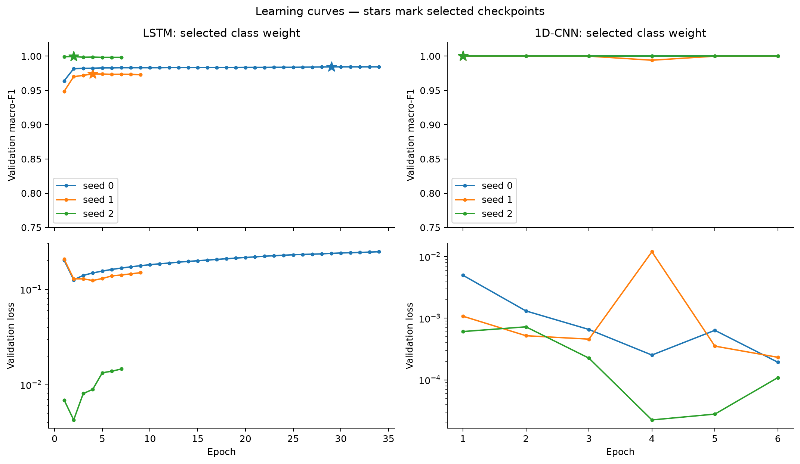
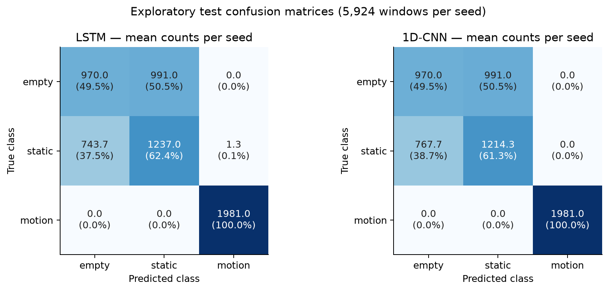
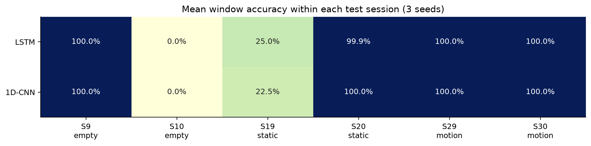

# 1D-CNN과 LSTM 실데이터 비교 보고서

> 상태: **SUPPORTING ANALYSIS — 2026-09-17 1D-CNN 6회 학습·3회 test 및 LSTM 비교 완료**
>
> 데이터: `20260616` / 코드: [`CNN1D.py`](../../cnn1d/CNN1D.py) / 기준선: [LSTM baseline 보고서](lstm-baseline-report.md)
>
> 원시 지표·계산 결과: [summary.json](assets/cnn1d-vs-lstm/summary.json)

## 1. 결과 요약

**1D-CNN은 학습 비용을 줄였지만, 학습에 사용하지 않은 test 세션의 인식 성능을 개선하지 못했다.**

- 파라미터: **297,347 → 53,763개**, **81.92% 감소**.
- Epoch당 학습·validation 시간: **17.84 → 4.87초**, 관측값 기준 **약 3.67배 빠름**.
- Validation macro-F1: **0.9860 → 1.0000**.
- Test macro-F1: **0.7051 → 0.7015**, **0.36%p 하락**.
- Test session accuracy: 두 모델 모두 **66.67%**, 6개 중 4개 성공.
- 두 모델 모두 모든 seed에서 **session 10(empty→static), session 19(static→empty)**를 틀렸다.

따라서 CNN을 빠른 후속 실험용 기준모델로 사용할 근거는 생겼다. 인식 정확도가 더
높아졌다는 근거는 없다. 관측된 작은 점수 차이만으로 모델의 통계적 우열이나 동등성을
판정하지 않는다. 이미 확인한 test split의 결과이므로 이번 비교는 탐색적 결과다.



## 2. 실험 조건과 비교의 공정성

### 데이터

실제 읽은 전처리 데이터 경로:

```text
/Users/jaehyeog/my/Wifi_esp32/model_train/preprocessing/output/20260616
```

| Split | Session 수 | Window 수 | empty / static / motion |
|---|---:|---:|---|
| Train | 17 | 16,728 | 5,857 / 5,922 / 4,949 |
| Validation | 6 | 5,933 | 1,971 / 1,980 / 1,982 |
| Test | 6 | 5,924 | 1,961 / 1,982 / 1,981 |

입력은 3-RX CSI amplitude `(300, 192)`이며 window 길이 3초, stride 0.3초다.
기존 session 배정과 train 통계 정규화를 그대로 사용했다. 세 split의 shape, dtype,
metadata, session 중복과 전체 NaN/inf 검사를 통과했다. 원본·전처리 데이터와 라벨을
수정하지 않았다.

기존 LSTM 6개 run과 현재 데이터의 manifest 및 normalization SHA-256이 일치했다.
이번에는 X/y/metadata 파일의 현재 SHA-256도 [protocol](assets/cnn1d-vs-lstm/protocol.json)에
기록했다. 과거 LSTM에는 X.npy 자체 hash가 없어 과거 배열과의 바이트 단위 동일성까지
소급 검증한 것은 아니다.

### 학습 조건

| 항목 | LSTM | 1D-CNN |
|---|---|---|
| 구조 | LSTM 2층, hidden 128, 마지막 시점 출력 | 시간축 Conv 3개, 평균 풀링 |
| 입력 | `(B, 300, 192)` | 동일 |
| Dropout | 0.2 | 0.2 |
| Optimizer / learning rate | Adam / 0.001 | 동일 |
| Batch size / workers | 32 / 0 | 동일 |
| 최대 epoch / patience / min_delta | 50 / 5 / 0 | 동일 |
| Checkpoint 선택 | validation window macro-F1 최고 | 동일 |
| 탐색 범위 | none·balanced × seed 0·1·2 | 동일 |
| 선택된 class weight | balanced | none (동률 규칙) |
| 학습 장치 | Apple MPS | Apple MPS |
| Python / NumPy / PyTorch | 3.11.16 / 2.4.6 / 2.13.0 | 동일 |
| 플랫폼 | macOS 26.5.2 arm64 | 동일 |
| 학습 날짜 | 2026-09-01~02 | 2026-09-17 |

LSTM은 기존 지표와 예측 파일을 재사용했고 이번에 다시 학습하거나 test하지 않았다.
같은 탐색 범위와 선택 규칙 아래 선택된 모델을 비교한 것이다. 최종 class weight가
서로 달라 **모델 구조 하나의 효과만 분리한 ablation 실험은 아니다**.

## 3. CNN 학습과 설정 선택

실험 전에 [비교 실행 코드](../../analysis/run_cnn1d_comparison.py)와 선택 규칙을
고정했다. Validation 평균 macro-F1이 같은 경우 `none`을 선택하기로 했다.
6개 run을 모두 학습한 후 선택을 파일로 저장하고, 선택된 3개 checkpoint에만
각각 한 번 test를 실행했다.

| 모델 | none validation macro-F1 | balanced validation macro-F1 | 선택 |
|---|---:|---:|---|
| LSTM | 0.9386 ± 0.0512 | 0.9860 ± 0.0104 | balanced |
| 1D-CNN | 1.0000 ± 0.0000 | 1.0000 ± 0.0000 | none |

CNN에서는 6개 run 모두 첫 epoch에 validation accuracy와 macro-F1이 1.0000이 됐다.
점수가 같은 후속 epoch는 best checkpoint를 갱신하지 않는다. 이후 5 epoch 동안
최고 점수의 엄격한 개선이 없어 모두 epoch 6에서 종료했고, test에는 **epoch 1**의
가중치를 사용했다. 더 낮은 validation loss나 test 결과로 checkpoint를 바꾸지 않았다.

| Class weight | Seed | Best epoch | 완료 epoch | Val macro-F1 | Test macro-F1 | 학습·validation 시간 합계 |
|---|---:|---:|---:|---:|---:|---:|
| none | 0 | 1 | 6 | 1.0000 | 0.7027 | 29.65초 |
| none | 1 | 1 | 6 | 1.0000 | 0.7110 | 28.93초 |
| none | 2 | 1 | 6 | 1.0000 | 0.6906 | 29.04초 |
| balanced | 0 | 1 | 6 | 1.0000 | 미평가 (선택 제외) | 28.22초 |
| balanced | 1 | 1 | 6 | 1.0000 | 미평가 (선택 제외) | 24.64초 |
| balanced | 2 | 1 | 6 | 1.0000 | 미평가 (선택 제외) | 27.91초 |

선택 기록은 [selection.json](assets/cnn1d-vs-lstm/selection.json)에 있다.
`test_started: false`는 선택 당시 test가 시작되지 않았음을 보존한 값이다.
최종 6회 학습·3회 test 완료 상태는 [completed.json](assets/cnn1d-vs-lstm/completed.json)을 따른다.
전체 실행은 한국 시간 18:34:50~18:38:30, 약 3분 40초였다.



CNN의 validation 곡선이 좋아도 다른 세션의 신호 분포에서 잘 동작한다는 뜻은 아니다.
이 실험에서는 validation loss가 매우 낮은 첫 checkpoint조차 test에서 같은 두 세션을
실패했다. Validation loss의 epoch별 변화는 기록했지만 모든 epoch의 window별 확률은
별도로 저장하지 않았으므로 개별 예측의 확신도 변화를 추적하는 분석에는 제한이 있다.

## 4. 전체 성능과 seed별 결과

값은 선택된 seed 0·1·2의 **평균 ± 모집단 표준편차(ddof=0)**다. 표준편차는 seed에
따른 변화량이며 신뢰구간이 아니다. `%p`는 0~1 점수 차이에 100을 곱한 값이다.

| 지표 | LSTM balanced | 1D-CNN none | CNN − LSTM |
|---|---:|---:|---:|
| Validation macro-F1 | 0.9860 ± 0.0104 | 1.0000 ± 0.0000 | +1.40%p |
| Test accuracy | 0.7070 ± 0.0069 | 0.7031 ± 0.0088 | -0.38%p |
| Test macro-F1 | 0.7051 ± 0.0066 | 0.7015 ± 0.0084 | -0.36%p |
| Test session accuracy | 0.6667 ± 0.0000 | 0.6667 ± 0.0000 | +0.00%p |
| Test session macro-F1 | 0.6667 ± 0.0000 | 0.6667 ± 0.0000 | +0.00%p |
| Validation − test macro-F1 | 0.2810 ± 0.0062 | 0.2985 ± 0.0084 | +1.76%p |

CNN의 test macro-F1 표준편차는 0.0084로 LSTM의 0.0066보다 컸다.
Validation에서는 CNN이 더 일관적이었지만 test 안정성까지 개선되지는 않았다.
Validation-test 격차도 0.2810에서 0.2985로 커졌다.

| 모델 | Seed | Test accuracy | Test macro-F1 | Static recall | Session accuracy |
|---|---:|---:|---:|---:|---:|
| LSTM | 0 | 0.7005 | 0.6990 | 0.6049 | 0.6667 |
| LSTM | 1 | 0.7037 | 0.7019 | 0.6145 | 0.6667 |
| LSTM | 2 | 0.7166 | 0.7142 | 0.6529 | 0.6667 |
| 1D-CNN | 0 | 0.7044 | 0.7027 | 0.6165 | 0.6667 |
| 1D-CNN | 1 | 0.7132 | 0.7110 | 0.6428 | 0.6667 |
| 1D-CNN | 2 | 0.6918 | 0.6906 | 0.5787 | 0.6667 |

## 5. Class별로 무엇이 달라졌는가

| Class | 지표 | LSTM | 1D-CNN |
|---|---|---:|---:|
| empty | precision | 0.5664 ± 0.0135 | 0.5587 ± 0.0167 |
| empty | recall | 0.4946 ± 0.0000 | 0.4946 ± 0.0000 |
| empty | f1 | 0.5280 ± 0.0058 | 0.5246 ± 0.0074 |
| static | precision | 0.5551 ± 0.0081 | 0.5504 ± 0.0107 |
| static | recall | 0.6241 ± 0.0207 | 0.6127 ± 0.0263 |
| static | f1 | 0.5875 ± 0.0137 | 0.5798 ± 0.0177 |
| motion | precision | 0.9993 ± 0.0009 | 1.0000 ± 0.0000 |
| motion | recall | 1.0000 ± 0.0000 | 1.0000 ± 0.0000 |
| motion | f1 | 0.9997 ± 0.0005 | 1.0000 ± 0.0000 |

- **Empty:** recall은 49.46%로 동일하다. 성공 세션 9와 실패 세션 10의 구분이 그대로 남았다.
- **Static:** recall은 62.41%에서 61.27%로 약 1.14%p 하락했다. 주요 과제인 정지 상태 구분의 개선이 없었다.
- **Motion:** 두 모델 모두 recall 100%다. CNN은 precision도 100%가 됐지만 이미 LSTM에서도 거의 완벽했던 class다.



그림의 건수는 seed별 confusion matrix의 평균이며 각 모델에서 합계는 5,924개다.
Seed 3개의 예측을 새로운 독립 데이터 17,772개로 취급하지 않는다. Macro-F1은 각
seed에서 계산한 값을 평균했으며, 평균 confusion matrix에서 다시 계산한 값이 아니다.

## 6. 세션별 실패는 해결됐는가

아래 session 예측은 각 모델의 **세 seed 모두 동일**했다. 세션 내 window의 softmax
확률을 class별로 평균한 뒤 가장 큰 값을 session 예측으로 선택한다.

| Session | 실제 class | Window 수 | LSTM / CNN session 예측 | LSTM window 정확도 평균 | CNN window 정확도 평균 |
|---|---|---:|---|---:|---:|
| 9 | empty | 970 | empty / empty | 100.00% | 100.00% |
| 10 | empty | 991 | static / static | 0.00% | 0.00% |
| 19 | static | 991 | empty / empty | 24.96% | 22.54% |
| 20 | static | 991 | static / static | 99.87% | 100.00% |
| 29 | motion | 990 | motion / motion | 100.00% | 100.00% |
| 30 | motion | 991 | motion / motion | 100.00% | 100.00% |



**Session 10:** 두 모델 모두 991개 window를 전부 `static`으로 분류했다. CNN의
세션 평균 `static` 확률은 seed 평균 약 99.97%다. 정답 `empty`에 가까워졌다고 볼
근거가 없으며 높은 예측 확률도 실제 정답을 보장하지 않았다.

**Session 19:** LSTM window 정확도는 평균 24.96%, CNN은 22.54%다. CNN의
seed별 정확도는 23.31%, 28.56%, 15.74%였고 세션 예측은 모두 `empty`였다.
Session 20의 작은 오류는 사라졌지만 더 어려운 session 19는 해결되지 않았다.

[기존 신호 분석](session-signal-audit.md)에서는 S10의 평균 CSI 형태가 train static,
S19가 train empty에 더 가까웠고, S19에서 시간에 따른 신호 변화가 관측됐다.
서로 다른 모델에서도 같은 방향의 세션 오류가 반복된 것은 세션 간 신호 분포 차이를
추가로 조사할 근거다. **라벨 오류, 수집 환경, 전처리 또는 모델 중 무엇이 원인인지는
이번 비교로 확정할 수 없다.** 신뢰하지 않는 환경 snapshot은 판단 근거로 사용하지 않았다.

## 7. 실제로 나아진 부분: 모델 크기와 학습 비용

| 항목 | LSTM | 1D-CNN | 해석 |
|---|---:|---:|---|
| 학습 파라미터 | 297,347 | 53,763 | 81.92% 감소, 기존의 18.08% |
| Epoch당 시간 | 17.84 ± 0.57초 | 4.87 ± 0.05초 | 관측된 시간 72.72% 감소, 약 3.67배 빠름 |
| 선택된 설정의 run당 시간 | 304.38 ± 233.49초 | 29.21 ± 0.32초 | CNN은 모든 seed에서 6 epoch 종료 |
| Best epoch (seed 0·1·2) | 29 / 4 / 2 | 1 / 1 / 1 | CNN은 첫 epoch에 validation 최고점 |
| 완료 epoch (seed 0·1·2) | 34 / 9 / 7 | 6 / 6 / 6 | 동일 patience 규칙 적용 |

Epoch 시간은 `history.jsonl`의 학습과 validation·세션 집계 시간을 포함한다.
각 run의 평균 epoch 시간을 먼저 구한 뒤 seed 3개를 평균했다. 데이터 검사, 프로세스
시작, checkpoint 파일 저장, 최종 test는 이 epoch 시간에서 제외된다. Run당 시간도
history의 epoch 시간 합계다. 첫 epoch의 장치 초기화 비용은 포함된다.
같은 장치 종류·소프트웨어 환경이지만 측정 날짜와 시스템 부하가 다르므로 정밀하게
통제한 속도 benchmark는 아니다. **추론 지연·최대 메모리·ESP32 탑재 가능성은 측정하지 않았다.**

구조상 CNN은 192개 feature를 channel로 받아 시간축의 국소 패턴을 병렬로 추출하고,
3초 window 전체 위치의 표현을 평균한다. 추론에서 BatchNorm 통계를 고정했을 때 마지막 convolution 표현 하나는
경계 padding을 제외하면 최대 24 frame, 약 0.24초 범위의 입력을 본다. 이후 평균 풀링이
전체 window를 합친다. LSTM은 순차적으로 상태를 갱신하고 마지막 시점의 출력을 사용한다.
소형 channel 구성과 순환 계산 제거는 계산 비용 감소를 설명하는 구조적 차이다.
BatchNorm·pooling·모델 크기·class weight를 각각 분리해 실험한 것은 아니므로 어느
요소가 점수 차이를 만들었는지는 단정하지 않는다.

## 8. 판단과 다음 실험

**판단:** 1D-CNN은 계산 비용이 적은 비교 기준으로 유용하다. 현재 결과만으로는
LSTM보다 인식 성능이 좋은 모델이나 실사용 모델로 채택할 수 없다.

이번 결과는 validation 점수만으로 모델을 선정할 때 한계가 있음을 보여준다.
다음 순서는 동일한 test 점수를 높이기 위한 반복 튜닝보다 다음 검증 공백을 메우는 데 둔다.

1. Train/validation의 23개 세션에서 session 단위 교차검증을 수행하고, 각 분할의
   train으로 normalization과 class weight를 새로 계산한다. CNN의 빠른 학습은 이 비용을 낮출 수 있다.
2. 기존 제안대로 평균·분산 등 통계 feature baseline을 같은 분할로 비교한다.
   Empty/static 구분에서 복잡한 시간 모델의 이점이 있는지 확인한다.
3. S10·S19의 실제 라벨과 수집 조건을 독립 자료로 확인하고 다양한 날짜·배치의
   새 세션을 확보한다. 오분류를 근거로 기존 라벨을 수정하지 않는다.
4. 설정을 결정한 뒤 새 미사용 holdout에서 window/session 성능을 함께 평가한다.

이번에 교차검증, 통계 baseline, 추가 수집 또는 새 holdout 평가를 실행한 것은 아니다.
현재 test는 class당 session이 2개여서 session 하나가 전체 session accuracy를
16.67%p 바꾼다. Window가 90% 중첩되므로 window 수를 독립 표본 수로 놓은 통계적
유의성 주장도 하지 않는다.

## 9. 재현과 검증 산출물

- [CNN 실험 디렉터리](../../cnn1d/runs/20260917-comparison): 6개 run의 checkpoint/config/normalization/history/validation, 선택된 3개 run의 test 예측·지표.
- [실행 protocol과 파일 hash](assets/cnn1d-vs-lstm/protocol.json), [test 이전 선택](assets/cnn1d-vs-lstm/selection.json), [완료 기록](assets/cnn1d-vs-lstm/completed.json).
- [CNN 6개 run 지표 snapshot](assets/cnn1d-vs-lstm/cnn-runs-snapshot.json), [기존 LSTM 6개 run 지표 snapshot](assets/cnn1d-vs-lstm/lstm-baseline-snapshot.json).
- [전체 집계 JSON](assets/cnn1d-vs-lstm/summary.json), [자동 생성 수치 표](assets/cnn1d-vs-lstm/tables.md).
- [검증 기록](assets/cnn1d-vs-lstm/verification.json): 두 모델의 test 예측 총 **35,544행**에서 window ID·session·시작 tx_seq·정답을 대조하고, 확률/argmax, confusion matrix, macro-F1, 세션 집계를 다시 계산해 저장 지표와 일치함을 확인했다.

CNN 학습 코드 `CNN1D.py`와 공통 runner `LSTM.py`는 커밋 `0a563fe`의 파일과
SHA-256이 일치한다. 실험 시작 시 두 파일과 실행 스크립트를 실험 디렉터리의
`source/`에 복사했다. 문서·실험 스크립트가 미커밋 상태여서 run의 `source.dirty`는
true이며, 코드별 hash와 snapshot으로 실제 실행 버전을 보완했다. 과거 LSTM의
미커밋 작업 트리 제한은 기존 baseline 보고서에 기재된 범위를 따른다.

새 실험 디렉터리로 같은 프로토콜을 실행하는 명령:

```bash
MPLCONFIGDIR=/tmp/meshsense-matplotlib conda run --no-capture-output -n wifi-csi-lstm python -u   model_train/analysis/run_cnn1d_comparison.py   --dataset-dir /Users/jaehyeog/my/Wifi_esp32/model_train/preprocessing/output/20260616   --output-dir model_train/cnn1d/runs/20260917-comparison-repro   --device mps
```

기존 산출물에서 수치와 그림만 재생성하는 명령:

```bash
MPLCONFIGDIR=/tmp/meshsense-matplotlib conda run -n wifi-csi-lstm python model_train/analysis/summarize_cnn1d_comparison.py   --cnn-experiment model_train/cnn1d/runs/20260917-comparison   --lstm-snapshot model_train/docs/model-training/assets/cnn1d-vs-lstm/lstm-baseline-snapshot.json   --output-dir model_train/docs/model-training/assets/cnn1d-vs-lstm
```

모델 run 디렉터리는 `.gitignore` 대상인 로컬 산출물이다. 보고서와 함께 보존할 수치
snapshot·hash·그림은 `assets/cnn1d-vs-lstm/`에 별도로 둔다. Checkpoint와 전체 예측
JSONL이 필요한 경우 위 실험 디렉터리도 함께 보관해야 한다.
