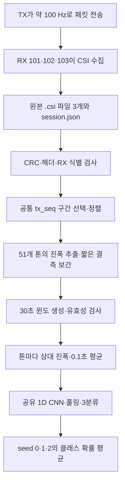
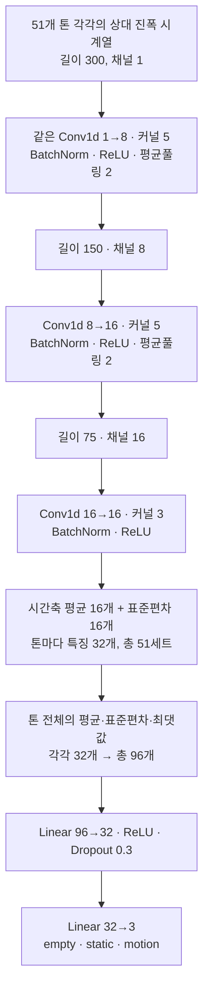
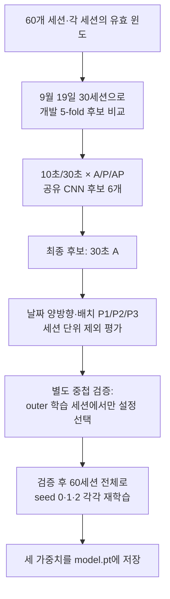
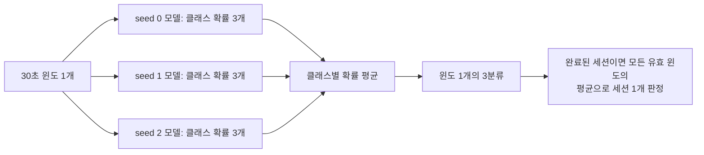

# 30초 상대 진폭 3분류 모델: 전처리부터 학습까지

> 상태: **SUPPORTING ANALYSIS — 2026-09-24에 완료한 별도 실험의 구현 해설**
> 대상: `empty`(빈 공간) / `static`(가만히 있는 사람) / `motion`(움직이는 사람)
> 범위: 공식 192차원 LSTM·CNN 경로가 아닌 `model_train/robust/`의 최종 **A(진폭) 모델**

한 줄 요약: **원본 CSI → 3개 수신기 동기화 → 30초 상대 진폭 시계열 51개 →
동일한 1D CNN으로 각각 검사 → 특징을 합쳐 3분류 → 독립 학습 모델 3개의 확률 평균**.

Mermaid 그림이 표시되지 않는 뷰어에서도 위 한 줄과 각 절의 설명만으로 흐름을
읽을 수 있다. 실측 점수와 한계는 [결과 보고서](robust-three-class-report.md)를 참고한다.

## 1. 전체 흐름

학습용 원본은 2026-09-19·20의 60세션(클래스별 20세션), 수신기별 `.csi`
180개다. 정답은 각 세션의 `session.json`에서만 읽는다. 파일명·날짜·배치·사진은
모델 입력이 아니라 자료 관리와 평가 분할에 사용한다. 원본 읽기·정렬 코드는
[`prepare_phase_experiment.py`](../../analysis/prepare_phase_experiment.py), 최종 모델의
원본 추론 어댑터는 [`predict.py`](../../robust/predict.py)에 있다.

## 2. 원본 CSI를 시간표에 맞추기

1. 각 RX의 binary v4 프레임에 대해 길이·헤더·CRC-32·수신기 ID를 검사한다.
   원본 추론 경로는 학습 때와 같은 RF 조건도 검사한다.
2. 각 RX에서 TX 재부팅·손상 후보를 고려해 연속 구간을 찾고, 세 RX가 공통으로
   관측한 `tx_seq` 범위를 고른다. RX 자신의 `seq`나 시계로 서로를 정렬하지 않는다.
3. 공통 `tx_seq` 격자에 RX 101, 102, 103 순으로 배치한다. 내부 결측은 최대
   **5프레임**까지만 선형 보간한다. 더 긴 진폭 결측을 포함한 윈도는 버린다.
4. 각 CSI 패킷에서 I/Q를 복소수로 해석하고 크기 `|I + jQ|`를 진폭으로 쓴다.
   RX당 원본 인덱스 `[38..63, 2..26]`의 **51개 톤**을 사용한다.

이 단계의 정렬된 배열은 한 시점에 `3 RX × 51톤 = 153개 진폭`을 갖는다.
기존 위상 실험 캐시는 진폭 153 + 위상 sine 153 + 위상 cosine 153 = `(T,459)`이나,
**선택된 A 모델은 앞의 진폭 153개만 사용**한다. 새 데이터의 추론에는 위상이
필요하지 않다. 자세한 결측·위상 비교 규칙은
[전처리 문서](../preprocessing/robust-window-features.md)에 있다.

## 3. 한 개의 30초 입력 만들기

[브라우저에서 단계별로 보기](relative-amplitude-window-explainer.html) — 그림이 표시되지
않는 환경을 위한 독립 HTML이다. `다음`을 눌러 다섯 단계를 넘길 수 있다.

`3000`은 100 Hz 기준 30초의 프레임 수다. 원본은 시간별 `tx_seq` 격자에 놓이며,
0.1초씩 10프레임을 평균해 CNN이 읽는 시간 위치는 `300`개가 된다. 30초 윈도는
15초 간격으로 겹쳐 만든다. 각 RX의 51톤 중 인덱스 `0, 3, 6, …, 48`을 택하므로
RX당 17개, 총 51개 시계열이다. **CNN의 한 번 입력은 한 RX의 한 톤이 가진
300개 시간값**이다. RX가 다르면 톤 번호가 같아도 별개 시계열이다.

각 톤에서 윈도 전체의 진폭 평균을 `m`이라 할 때, 먼저 각 값 `A(t)`를
`A(t) / (m + 0.5)`로 바꾼다. 이후 10프레임 평균을 구하고, 그 300개 값의
시간 평균을 빼서 중심화한 다음 3배하고 `[-20, 20]`으로 제한한다. 따라서
절대 진폭의 크기보다는 **그 톤이 이 30초 동안 자기 평균에서 어떻게 달라졌는지**를
입력한다. `0.5`는 작은 평균에 나눌 때 값이 지나치게 커지는 것을 완화한다.
이 정규화는 **각 윈도 내부 값만** 사용하며 다른 세션의 통계나 정답을 보지 않는다.

학습 캐시는 과거 A/P/AP 후보 비교용 `(윈도 수, 300, 51, 3)` 배열을 저장하지만,
최종 A 모델은 첫 번째 진폭 채널만 CNN에 전달한다. 추론용
[`amplitude_input()`](../../robust/shared_temporal.py)은 위상 없이 같은 진폭 채널을
만든다. 30초 후보 1,133개 중 1,124개가 유효했고 9개는 진폭 결측으로 제외됐다.
이번 30초 캐시에서는 위상 품질 기준으로 **추가** 제외된 윈도는 0개였다.

## 4. 공유 시간 인코더의 실제 구조

위 그림의 CNN 블록은 **톤마다 새로 학습되는 CNN 51개가 아니다.** 가중치가 같은
CNN **하나를 51개 신호에 반복 적용**한다. 각 신호에서 시간적 변화 특징 32개를
뽑고, 신호 전체에서 평균·표준편차·최댓값을 계산해 96개 특징으로 만든다.
모델은 이 경로에서 톤 번호와 RX 번호를 별도 식별자로 받지 않는다. 이 구조의
학습 가능한 파라미터는 모델 하나당 **4,731개**다. 세 모델을 평균하는 앙상블은
뒤의 별도 단계이며, 여기서 말하는 RX 3개와 다른 의미다.

구현: [`SharedEncoder`](../../robust/shared_temporal.py). 톤 풀링은 입력 순서에
덜 의존하게 하지만, 이 데이터만으로 특정 물리 현상(예: 호흡)을 직접 감지했다고
증명하는 것은 아니다.

## 5. 어떻게 학습하고 검증했나

- **분할 단위는 세션**이다. 한 세션에서 겹쳐 뽑은 윈도들이 학습과 검증 양쪽에
  나뉘지 않는다. 9/19 개발 5-fold는 클래스별 세션 10개 중 2개씩을 각 fold의
  검증에 배정했다. 같은 세션의 윈도가 지나치게 많아지지 않도록 학습에는
  세션당 최대 48개를 균등 선택하고 세션·클래스별 가중치를 적용한다.
- **후보 탐색**에서는 10초/30초와 진폭(A)/위상(P)/둘 다(AP)를 비교했다.
  별도의 통계 특징·전통적 분류기 후보 180개도 비교했지만, 최종 저장 모델은
  위 공유 CNN의 30초 A다. 후보 선택과 점수의 범위는 [설계](robust-three-class-design.md)와
  [결과](robust-three-class-report.md)를 따른다.
- **한 번 학습할 때** batch 32, AdamW(`lr=0.001`, weight decay `0.01`),
  cosine 학습률 스케줄, label smoothing `0.1`, gradient norm 제한 `2.0`을 쓴다.
  총 **15 epoch 고정**이며 검증 성적이 가장 높은 epoch를 다시 고르지 않는다.
  훈련 중에는 RX별 진폭 gain을 `0.8~1.2`로 바꾸고, batch마다 51개 톤 중
  39개만 무작위로 남긴다. 평가·추론 때는 gain 변경과 톤 제거를 하지 않는다.
- **검증**은 선택한 설정을 날짜 9/19 또는 9/20, 혹은 배치 P1/P2/P3의
  세션 전체를 제외하고 평가했다. 추가 중첩 검증은 각 outer 학습 세션 안에서만
  설정을 다시 선택했다. 기존 두 날짜 자료의 재검증이므로 새로운 날짜의 독립
  실험과 같지 않다.
- **최종 저장**은 검증이 끝난 뒤 60세션 전체로 시작값(`seed`)만 달리한
  모델 3개를 각각 15 epoch 학습한 것이다. 저장 파일은
  `model_train/analysis/output/20260924-robust-three-class/neural/model.pt`이다.

학습 루프·후보 탐색·최종 저장은 [`shared_temporal.py`](../../robust/shared_temporal.py),
세션 분할·윈도 색인·점수 계산은 [`run_experiment.py`](../../robust/run_experiment.py),
중첩 검증은 [`nested_validation.py`](../../robust/nested_validation.py)에 있다.

## 6. 예측할 때는 무엇을 평균하나

예를 들어 세 모델의 `motion` 출력이 `0.7, 0.8, 0.6`이면 앙상블의 해당
출력은 `0.7`이다. 다른 두 클래스도 같은 방식으로 평균한 뒤 가장 큰 값을
고른다. **3-seed는 수신기 3개가 아니라 독립 학습한 모델 3개**다. 이 출력은
별도의 확률 보정을 거친 신뢰도가 아니다.

30초가 모여야 첫 윈도를 만들 수 있다. 이후 15초 간격으로 새 윈도를 만들며,
완료된 약 5분 세션의 성능 표는 그 세션의 **모든 유효 윈도 출력 평균**을
사용한다. 따라서 보고서의 세션 점수는 첫 30초 판정의 정확도와 다르다.
현재 [`predict.py`](../../robust/predict.py)는 정렬 배열 또는 **수집 완료된**
원본 세션의 오프라인 추론용이다. GUI/실시간 스트리밍 판정은 아직 연결하지 않았다.

## 7. 결과를 어디까지 믿을 수 있나

고정 30초 A 앙상블은 9/19로 학습해 9/20을 평가한 30세션과 그 반대 방향
30세션에서 모두 세션 판정 `30/30`이었다. 하지만 반대 방향의 **첫 유효 30초**는
`28/30`이었다. 이는 각 평가 날짜를 학습에서 뺀 **평가용 checkpoint**의 점수이며,
60세션 전체로 재학습한 저장 파일의 독립 시험 점수가 아니다. 이 수치들은
**이미 실험에 쓰인 두 날짜의 고정 라벨 세션**에서 얻은 것이다. 다른 방·새 날짜·
상태 전환 중 오경보율과 지연은 아직 검증하지 않았다. 실사용 안정성을 확정하려면
이 모델을 고정한 채 새 자료로 평가해야 한다.
