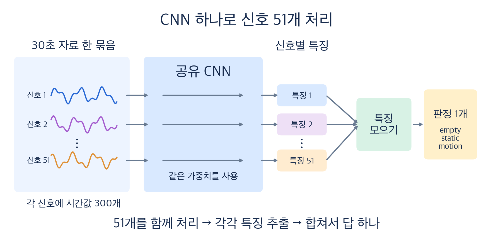

# 쉽게 읽는 3분류 모델 학습 결과

> 상태: **SUPPORTING ANALYSIS — 2026-09-24 완료된 학습 결과의 쉬운 해설**
> 자세한 수치와 검증 파일은 [원래 결과 보고서](robust-three-class-report.md)가 기준이다.
> 왜 이런 방식으로 시험했는지는 [쉬운 설계 설명](robust-three-class-design-easy.md)에 있다.

## 먼저 결론

**기존 60세션으로 모델 학습을 마쳤다.** 선택한 방식은 30초 동안의
**상대 진폭**을 보는 작은 CNN을 세 번 따로 학습하고, 세 모델의 답을 평균하는
것이다. `empty`(빈 공간), `static`(가만히 있는 사람), `motion`(움직임)을 고른다.

기존 두 날짜 자료에서 정해 둔 평가 기준은 통과했다. 하지만 **새 날짜·새 방에서
최종 저장 파일이 얼마나 맞는지는 아직 모른다.** 그래서 “실사용 정확도 100%”라고
말할 수 없다.

## 모델에는 무엇을 넣나

수신기 3대에서 진폭 신호를 17개씩 골라 **총 51개 신호**를 쓴다. 신호마다
최근 **30초**를 보고, 절대 크기 대신 **그 신호의 30초 평균에 비해 얼마나
변했는지**를 계산한다. 30초의 3,000개 원래 시간값을 10개씩 평균해
신호마다 **300개 시간값**으로 줄인다.

CNN은 51개 신호를 같은 규칙으로 하나씩 검사한다. 그리고 세 상태에 대한
점수를 낸다. 이 구조를 시작값만 바꿔 **세 번 따로 학습**했다. 예측할 때는
세 모델의 점수를 평균한다. 수신기 3대와 모델 3개는 서로 다른 이야기다.
최종 선택 모델은 **진폭만** 쓰며 위상은 쓰지 않는다.

30초짜리 판단 구간은 **15초씩 이동**한다. 처음 판단하려면 최소 30초를
모아야 한다. 15초 간격이 최선인지 따로 비교한 것은 아니다.

## 60세션을 어떻게 썼나

처음에는 9/19의 30세션을 5번 나눠 후보를 비교했다. 매번 24세션으로 학습하고
6세션으로 평가했다. 그다음 선택한 **같은 모델 구조**를 새로 학습해, 한 날짜를
통째로 빼거나 수신기 배치 하나를 통째로 빼고 평가했다. 한 세션의 겹치는
30초 구간이 학습과 평가 양쪽에 들어가지 않게 했다.

**마지막에 저장한 `model.pt`는 60세션 전부로 다시 학습한 파일**이다.
30초 구간 후보 1,133개 중 결측이 있는 9개를 제외해 **1,124개 구간**을
사용했다. 모델 3개를 각각 **15 epoch** 학습했다. 1 epoch은 그 학습 구간들을
한 번씩 보는 것이다. 이 최종 학습에서는 60세션 안에 별도 검증·테스트
세션을 남기지 않았다.

## 얼마나 맞았나

아래는 **최종 파일의 시험 점수가 아니다.** 표의 각 방향마다 평가 날짜를
학습에서 제외하고 따로 학습한 **평가용 모델**의 점수다.

| 학습 → 평가 | 30초 구간별 정확도 | 각 세션의 첫 30초 | 약 5분을 모은 세션 판정 |
|---|---:|---:|---:|
| 9/19 → 9/20 | 97.31% | 30/30 | 30/30 |
| 9/20 → 9/19 | 95.59% | 28/30 | 30/30 |

**30/30 세션 판정**은 약 5분 동안 나온 여러 30초 구간의 결과를 평균했을 때
30세션을 모두 맞혔다는 뜻이다. 한 번의 30초 판단이 늘 맞는다는 뜻은 아니다.
두 번째 방향의 첫 30초에서 틀린 2세션은 실제 `static`인데 `empty`라고 했다.

수신기 배치 P1·P2·P3를 각각 빼고 평가한 세션 판정도 `24/24`, `18/18`,
`18/18`이었다. **새로운 60세션을 추가로 평가한 숫자가 아니라**, 같은
60세션을 다른 방식으로 나누어 다시 확인한 것이다. 배치가 같아도 방 안의
다른 조건이 완전히 같았다는 뜻은 아니다.

## 후보 선택까지 다시 검사한 이유

처음에는 9/19 자료를 보면서 30초 진폭 모델을 골랐다. 따라서 나중에
9/19를 평가 대상으로 쓰면 “처음부터 아무것도 모르던 자료”라고 할 수 없다.
이 문제를 줄이려고 평가할 날짜나 배치를 먼저 숨긴 뒤, **남은 학습 세션만으로
후보를 다시 고르는 절차**도 시험했다. 다섯 평가 조건 모두 미리 정한 기준을
통과했다.

다만 이 절차에서 매번 같은 후보를 고른 것은 아니다. 예를 들어 9/19를
숨겼을 때는 **10초 진폭**이 선택됐고, 9/20을 숨겼을 때는 **30초 진폭+위상**이
선택됐다. 따라서 “30초 진폭이 모든 조건에서 반드시 최고”라고 단정하지
않는다. 이 검사 역시 이미 분석에 사용한 두 날짜의 재검증이지, 새로운
수집 자료를 대신하지 않는다.

## 어디까지 확인했고 무엇이 남았나

원본 `.csi` 파일 180개의 식별·해시를 다시 확인했고, 1,124개 모델 입력을
원래 정렬 자료에서 재생성해 일치함을 확인했다. 저장 모델을 다시 읽어 예측
경로가 동작하는지도 확인했다. 다만 이 확인에 쓴 원본 세션 예시는 **학습에
포함된 자료**이므로 독립 정확도 시험이 아니다.

아직 확인하지 못한 것은 다음과 같다.

- 학습에 쓰지 않은 **새 날짜·새 환경**에서 최종 `model.pt`의 정확도
- 사람이 들어오거나 나가는 **상태 전환 중** 오경보와 반응 지연
- GUI·실시간 스트림에서의 실제 동작

현재 파일은 `model_train/analysis/output/20260924-robust-three-class/neural/model.pt`에
있다. 위 정확도는 **평가용 모델의 성적**이고, 최종 파일은 전체 60세션으로
다시 학습했으므로 둘을 같은 모델의 점수로 혼동하지 않아야 한다.
