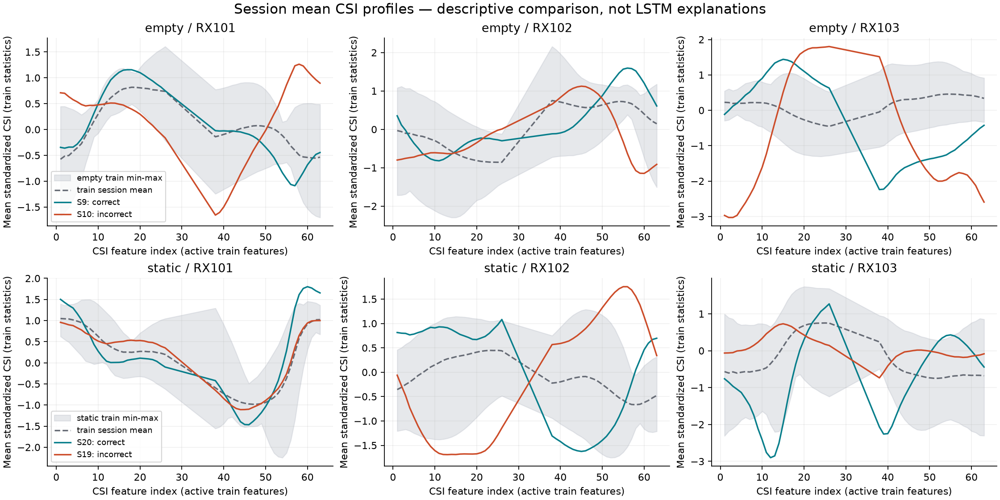
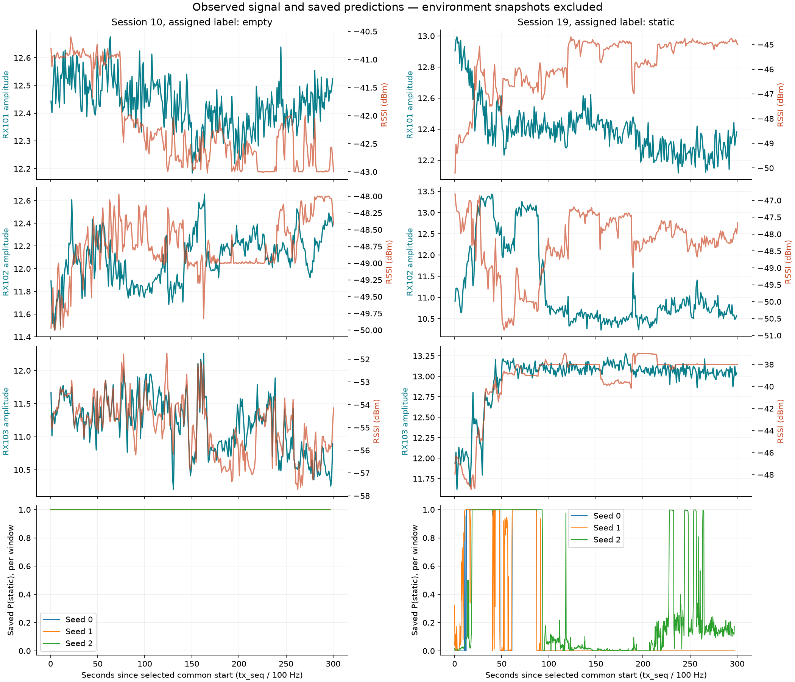

# Session 10 and 19 Signal Audit

> 상태: **SUPPORTING ANALYSIS — 2026-09-10 원본 대조·신호 비교 완료**
>
> 목적: 기존 test session 10·19의 오분류를 원본 수집 기록과 신호로 진단한다.
> 추가 학습·모델 선택은 수행하지 않았다. 실제 환경과 사람 상태는 미확인이다.

확인된 결과는 다음과 같다.

- 원본에서 재구성한 29개 세션의 **28,585개 window가 기존 `X.npy`와 정확히 일치**했다.
  Manifest의 세션별 전처리 기록과 라벨 ID·window 순서도 일치했다.
- 평균 CSI 형태의 거리를 비교하면 session 10은 train의 static 세션에, session 19는
  train의 empty 세션에 더 가까웠다. 이는 기록된 오분류 방향과 일치하는 기술통계다.
- Session 10은 세 seed 모두 처음부터 끝까지 static으로 예측했다. Session 19는
  약 90초 전후 RX102 신호 변화와 함께 static 정답률이 크게 떨어졌다.
- Snapshot의 환경 정보는 사용하지 않았다. 신호 차이의 원인이 사람 상태·배치·장비
  상태 중 무엇인지는 이번 자료만으로 확정할 수 없다.

## 1. 근거와 신뢰 범위

사용자의 확인에 따라 `session_meta_snapshot.yaml`의 환경 정보는 신뢰하지 않으며
이번 분석의 입력에서 제외한다. 사람 유무·위치·장비 배치는 해당 snapshot으로
확인하거나 추정하지 않는다. Snapshot 원본도 수정하지 않는다.

분석 입력은 원본 `device_<id>.jsonl`, 당시 reader 로그, 공식 전처리 manifest·배열,
기존 모델의 저장된 test 예측이다. JSONL의 수신 시각은 Mac이 기록한 시각이며
실제 RF 수신 시각이나 장비 간 동기 시각으로 간주하지 않는다.

Session 10=`empty`, 19=`static`은 기존 데이터셋의 배정 라벨이다. Manifest·학습
입력·예측 파일의 라벨 일치 여부는 검사하지만, 이것이 수집 당시의 실제 사람 상태를
독립적으로 입증하지는 않는다. 원인 판단에는 이 제한을 유지한다.

## 2. 분석 방법

분석은 원본과 저장 입력의 일치를 확인한 뒤, 세션별 신호를 요약하고 기존 예측과
비교하는 순서로 진행했다. 아래에서 사용하는 용어의 뜻은 다음과 같다.

| 용어 | 이 분석에서의 의미 |
|---|---|
| Frame | 공통 송신 순번 `tx_seq` 하나에 대응하는 시간 위치. 세 RX의 CSI를 이 순번으로 정렬한다. |
| Window | 연속된 300 frame을 묶은 모델 입력. 다음 window는 30 frame 뒤에서 시작해 270 frame이 겹친다. |
| CSI feature | 특정 RX의 CSI 진폭 배열에서 한 위치의 값. 예를 들어 `RX102의 csi_amp[17]`이며, RX와 배열 위치를 함께 지정해야 같은 feature다. |
| 시간 평균 | 같은 feature의 값을 세션의 여러 시간 위치에 걸쳐 평균한 값. |
| 시간 변동 | 같은 feature가 시간에 따라 얼마나 달라졌는지 나타내는 표준편차. |

### 2.1 원본에서 입력을 다시 만들고 기존 파일과 대조

공식 전처리 함수로 원본 JSONL을 다시 처리해 사용된 29개 세션의 window를 재구성했다.
그 결과를 저장된 `X.npy`의 CSI 값, `y.npy`의 라벨 ID, window별 시작 `tx_seq`,
RX 순서 및 manifest의 전처리 기록과 비교했다. 기존 배열과 모델 파일은 읽기 전용으로
사용했다. 이 검사는 파일 간 대응을 확인하며 실제 사람 상태가 라벨과 같았는지는
독립적으로 확인하지 못한다.

### 2.2 중복 frame을 제거해 신호를 요약하고 train 기준으로 표준화

**먼저, 같은 시간 위치를 한 번씩 집계했다.** 같은 frame이 여러 window에 포함되므로
window를 그대로 이어 붙여 평균내면 일부 frame이 여러 번 계산된다. 이를 막기 위해
실제로 사용된 window들이 덮는 시간 위치의 합집합을 만들었다. 예를 들어 S10은
991개 window의 총 297,300칸을 따로 세는 대신, 서로 다른 시간 위치 30,000개를
각각 한 번씩 사용했다. 이 위치들에는 공식 전처리에서 짧은 누락을 보간한 값도 포함된다.
중복 제거는 이번 분석의 통계 계산에 적용했으며 기존 학습 window를 바꾸지 않았다.

**다음으로, 특정 RX의 n번째 CSI 값마다 시간 평균과 시간 표준편차를 구했다.**
계산할 때는 RX와 n을 고정하고 시간만 바꿔서 본다. 아래 숫자는 설명용 가상 예시다.

| 시간 위치 | RX102의 `csi_amp[17]` | RX102의 `csi_amp[18]` |
|---|---:|---:|
| Frame 1 | 2 | 10 |
| Frame 2 | 4 | 14 |
| Frame 3 | 6 | 18 |
| 시간 평균 | 4 | 14 |
| 시간 표준편차 | 약 1.63 | 약 3.27 |

17번 위치의 평균은 `(2+4+6)/3=4`다. 표준편차는 같은 열의 값들이 이 평균 주변에서
얼마나 흩어졌는지를 계산한다. 18번 위치는 별도로 평균과 표준편차를 구한다.
실제로는 세션의 사용 시간 위치 전체에서 RX별 64개 feature에 대해 계산했다.

**보고서에 표시하는 RX별 요약값은 여기서 한 번 더 평균낸 값이다.** Train에서
상수였던 feature를 제외하면 RX마다 52개가 남는다. RX의 평균 진폭은 이 52개
feature의 시간 평균을 다시 평균한 값이다. RX의 평균 시간 변동은 52개 시간
표준편차를 평균한 값이다. 위 예시의 두 feature만 사용한다면 각각 `9`와 약 `2.45`다.

**세션을 비교할 때는 feature마다 저장된 train 평균·표준편차를 공통 기준으로 썼다.**
위 표에서 어떤 세션의 `RX102의 csi_amp[18]`의 시간 평균은 14다. 같은 feature의
저장된 train 평균이 10, train 표준편차가 2라고 가정하면 다음과 같이 바꾼다.
train 통계 숫자는 설명용 가상 값이다.

```text
표준화한 세션 평균 = (세션의 시간 평균 - 저장된 train 평균) / 저장된 train 표준편차
                  = (14 - 10) / 2
                  = 2
```

결과 2는 해당 세션의 `RX102의 csi_amp[18]` 시간 평균이 같은 feature의
train 평균보다 train 표준편차의 2배만큼 높다는 뜻이다.
이 계산을 다른 feature에도 각각 적용하며, 모든 feature에 같은 평균 10·표준편차 2를
쓰는 것은 아니다. 시간 변동을 표준화할 때는 해당 feature의 시간 표준편차를
아래에서 설명하는 `std_safe`로 나눈다.

여기서 train 기준은 학습 당시 train window 전체의 시간 위치를 feature별로 집계해
`normalization.npz`에 저장한 값이다. 당시 집계에는 window 간 중복이 포함되어 있다.
이번 분석의 고유 frame 통계로 이를 다시 계산하지 않고, 모델이 사용했던 기준을
그대로 재사용했다. 표준편차가 0이면 0으로 나눌 수 없다. 그래서 train 표준편차가
`0.000001`보다 작은 feature는 나눗셈의 분모를 1로 바꿔 저장했다. 이 분모의 이름이
`std_safe`다. 예를 들어 train 평균이 10이고 표준편차가 0인 feature의 세션 평균이
10이라면 `(10 - 10) / 1 = 0`으로 계산한다. 이런 feature는 아래 세션 간 거리 비교에서
제외했다.

**세션 간 거리를 계산할 때는 RX 하나를 숫자 하나로 합치지 않았다.** 위 표에서
`RX102의 csi_amp[17]` 시간 평균은 4, `RX102의 csi_amp[18]`은 14이므로
두 위치의 RX 요약 평균은 9다. 다른 세션에서 두 값이 14와 4로 뒤바뀌어도
RX 요약 평균은 9다. 요약값만 비교하면 두 세션이 같아 보이지만,
같은 위치끼리 비교하면 다르다.

그래서 각 위치의 시간 평균을 **그 위치의 train 통계로 표준화한 뒤**,
`RX102의 csi_amp[17]`끼리, `RX102의 csi_amp[18]`끼리 비교했다. 실제 거리 계산에는
train에서 거의 변하지 않은 위치를 제외한 RX당 52개, 총 `3 RX × 52 = 156개`의
표준화된 시간 평균을 사용했다. 앞에서 구한 시간 표준편차는 신호가 시간에 따라
변했는지 설명하는 데 사용했고, 세션 간 거리 계산에는 넣지 않았다. 기존 LSTM의
입력은 계속 192개 feature이며, 이 분석에서 모델이나 새로운 정규화 방식을 선택하지 않았다.

### 2.3 성공·실패 세션의 원본 수집 기록 확인

배정 라벨이 같은 empty session 9·10과 static session 19·20을 짝지어 비교했다.
S9·20은 세션 대표 예측이 맞았고 S10·19는 틀렸다. 원본에 기록된 채널·RSSI 같은
RF 값, 순번, Mac 기록 시각 및 reader 로그를 대조해 수신 누락, 파싱 오류,
RX 재시작 전 잔여 record를 구분했다. 신뢰할 수 없는 snapshot의 환경 정보는
근거로 사용하지 않았다.

### 2.4 세션의 평균 신호 형태를 train 세션들과 비교

모든 train/validation 세션을 포함해 신호 통계를 계산했다. 거리 비교에서는 test
세션 하나와 train 세션 하나의 표준화 평균 156개를 같은 RX·CSI 위치끼리 뺐다.
그 차이들을 제곱해 평균한 뒤 제곱근을 취해 거리 숫자 하나로 요약했다. 거리가 작으면
이 기준에서 두 세션의 평균 신호 형태가 더 가깝다는 뜻이다.

가장 가까운 세션을 찾는 참조 대상은 train 세션들로 한정했다. Validation/test를
참조에 섞지 않았다. 계산식과 실제 거리는 4절에 기록했다. 이 거리는 평균 형태의
유사도를 나타내며, 3초 시계열 전체를 보는 LSTM의 판단 이유나 새 분류 성능을
직접 입증하는 지표는 아니다.

### 2.5 시간에 따른 신호 변화와 저장된 예측 비교

이미 저장된 세 seed의 window별 클래스 확률을 원본·정렬 후 신호의 시간 패턴과
나란히 비교했다. 세션의 공통 시작 `tx_seq`를 0초로 두고, 송신 순번 차이를
100 Hz 가정으로 초 단위로 바꿨다. Window 예측은 해당 window의 시작 시각에 맞췄다.

이를 통해 신호가 바뀌는 구간에서 예측도 달라지는지 확인했다. 시간상 함께 변화했다는
사실만으로 신호 변화가 오분류를 일으켰다거나 실제 사람 상태가 바뀌었다고 단정하지 않았다.

## 3. 수집 기록과 입력 대응 확인

선택된 공통 구간의 첫·마지막 Mac 기록 시각이다. 모두 2026-06-16 KST이며,
표에서는 초 아래를 생략했다. RF 수신 시각을 직접 측정한 값은 아니다.

| Session | 배정 라벨 | 선택 구간의 Mac 시각 | RX101 관측률 | RX102 관측률 | RX103 관측률 | gap으로 제외된 window |
|---:|---|---|---:|---:|---:|---:|
| 9 | empty | 15:42:31–15:47:31 | 99.75% | 90.52% | 90.10% | 21 |
| 10 | empty | 15:49:53–15:54:53 | 96.74% | 94.90% | 98.84% | 0 |
| 19 | static | 17:28:29–17:33:29 | 99.76% | 95.20% | 99.42% | 0 |
| 20 | static | 17:36:18–17:41:18 | 93.79% | 95.10% | 97.69% | 0 |

네 세션의 RX별 JSONL 12개에서 다음을 확인했다.

- JSON 파싱 오류는 0건이고 `session_id`·`device_id`는 파일 경로와 일치했다.
- 선택 구간의 `channel=11`, `rate=11`, `sample_count=64`, `sig_len=47`이었다.
- 각 파일 초반에 `seq`와 RX 타이머가 감소하는 경계가 한 번씩 있었다. 공식 전처리는
  이 경계에서 세그먼트를 나누고 이후 구간을 선택했다. 사용 구간에 초반 잔여 record가
  섞였다는 증거는 발견하지 못했다. 파일 전체의 `tx_seq`와 Mac 기록 시각 감소는 없었다.
- Reader 종료 로그의 저장 frame 수와 실제 JSONL record 수가 모두 일치했다.
  Session 19의 RX101 로그에는 `invalid=1`이 있다. 이는 reader의 binary 검증 실패
  카운터이며, 저장 JSON의 파싱 오류나 손상된 학습 window 1개를 뜻하지 않는다.
- Session 10·19의 선택 구간에서 가장 긴 내부 누락은 RX별 최대 4 frame이었다.
  공식 최대 5-frame 보간 범위 안에 있었고, 두 세션 모두 gap에 의한 window 제외는 없다.

성공한 session 9는 일부 RX 관측률이 실패한 session 10보다 낮았다. 이 결과만으로
누락의 모든 영향을 배제할 수는 없지만, 단순 수신 부족만으로 두 실패를 설명할 근거는 약하다.

재현 검사의 범위는 다음과 같다.

| 검사 | 결과 |
|---|---|
| 원본 → 공식 전처리 재구성 | 사용된 29개 세션의 manifest 항목 전체 일치 |
| 재구성 window → 저장 `X.npy` | 28,585개 window의 192개 feature 값 전체 일치 |
| 저장 `y.npy`·window metadata | 세션 배정 라벨 ID·RX 순서·시작 `tx_seq` 일치 |
| 기존 test 예측 → window metadata | 3 seed × 5,924개 = 17,772개 행의 대응과 예측 argmax 확인 |
| 모델 run의 dataset·normalization hash | 현재 manifest·normalization과 일치 |
| 9·10·19·20의 세션 확률 평균 | 저장된 세션 집계 재현 확인 |

이 검사는 기존 전처리의 재현성과 파일 간 대응을 확인한다. 전처리 설계가 행동 구분에
충분하다는 증명이나, 실제 라벨의 정답 여부 확인은 아니다.

## 4. 세션 사이의 평균 신호 형태

모든 train/validation/test 세션의 통계를 계산했다. 같은 frame을 중첩 window마다
반복 계산하지 않고, 실제 사용 window의 합집합에 들어가는 frame을 한 번씩 집계했다.
짧은 누락에 적용한 공식 보간값은 포함된다. 저장된 `X.npy`는 raw amplitude이며,
분석의 표준화에는 기존 train의 `mean`, `std_safe`를 적용했다.

거리는 각 세션의 feature별 평균을 표준화한 뒤, 두 세션 간 차이의 제곱평균제곱근으로
계산했다. Train에서 상수인 36개 feature는 거리·그림에서 제외해 156개(각 RX 52개)를
사용했다. 기존 LSTM의 입력 192개와 가중치는 변경하지 않았다.

```text
z(session, feature) = (세션의 고유 frame 평균 - 기존 train mean) / 기존 train std_safe
distance(A, B) = sqrt(mean((z(A) - z(B))²))  # 156개 feature
```

각 class의 train 세션 중 가장 가까운 세션을 찾은 결과다. Validation/test 세션을
거리 비교의 참조로 넣지 않았으며, 거리가 작을수록 이 평균 형태가 가깝다는 뜻이다.

| 대상 | 가장 가까운 train empty | 가장 가까운 train static | 가장 가까운 train motion |
|---|---|---|---|
| S9, empty | S6: **0.6997** | S15: 1.0740 | S25: 1.2740 |
| S10, empty | S5: 1.2103 | S11: **0.8990** | S23: 1.6182 |
| S19, static | S4: **0.4921** | S15: 0.7889 | S24: 1.3077 |
| S20, static | S6: 1.3398 | S13: **0.6242** | S21: 1.3074 |

S10의 가장 가까운 train 세션 3개는 모두 static(S11·15·14), S19는 모두
empty(S4·5·6)였다. 성공 사례 S9·20은 배정 라벨과 같은 class의 세션이 가장 가까웠다.

이 비교는 **평균 신호 형태만 사용하는 진단**이다. LSTM은 3초 시계열 전체를 보므로
이 거리만으로 모델이 실제로 사용한 feature나 오분류의 원인을 확정할 수 없다.



회색 영역은 해당 class의 train 세션 평균들 사이의 최솟값–최댓값이며, 신뢰구간이 아니다.
초록 선은 성공 세션, 주황 선은 실패 세션이다. 그래프 사이의 y축 범위는 다를 수 있다.

## 5. Session 10: 전 구간 static 예측

세 seed 모두 991개 window 전부를 static으로 예측했다. 잠깐 잘못 분류한 구간이
세션 평균을 뒤집은 형태가 아니라, 이번 세션의 사용 구간 전체에서 같은 방향으로 틀렸다.

동일한 empty 배정의 S9와 비교하면 RX103의 신호 차이가 두드러진다.

| RX103 측정값 | S9, 성공 | S10, 실패 |
|---|---:|---:|
| 원본 관측 record의 평균 RSSI | -44.91 dBm | -54.93 dBm |
| 사용 frame의 평균 amplitude | 11.7895 | 11.1769 |
| Feature별 시간 표준편차의 평균 | 0.9972 | 2.4011 |
| 보간 전 관측값으로 계산한 시간 표준편차의 평균 | 1.0097 | 2.4008 |

시간 표준편차는 RX103의 52개 활성 feature마다 시간축 표준편차를 구한 뒤 평균한
값이다. 위 수치는 S10의 변동이 보간 전에 이미 존재함을 보여준다. 다만 S9와의 차이를
사람의 존재, 장비 이동 또는 다른 환경 변화 중 하나로 해석할 근거는 아직 없다.

## 6. Session 19: 중간 신호 변화와 예측 전환

세션 전체를 단일 평균으로 보면 드러나지 않던 시간 패턴을 확인했다.
선택된 공통 시작 `tx_seq=1115315`를 0초로 두고 100 Hz를 가정한 결과다.

| 측정값 | 60–90초 | 90–120초 |
|---|---:|---:|
| RX102 원본 관측 amplitude 평균 | 12.9264 | 10.8903 |
| RX102 원본 관측 record 수 | 2,814 | 2,854 |
| Seed 0 window accuracy | 0.87 | 0.00 |
| Seed 1 window accuracy | 0.88 | 0.02 |
| Seed 2 window accuracy | 1.00 | 0.13 |

신호값은 보간 전 원본 관측값으로 계산했다. Accuracy는 **window 시작 시각**이 해당
30초 구간에 속하는 100개 window 기준이며, window가 서로 중첩되므로 독립 표본
100개로 해석하지 않는다.

약 90초 전후 RX102의 평균 amplitude가 낮아지는 동안 세 seed의 static 정답률도
크게 떨어졌다. Seed 0은 90초 이후 window를 모두 empty로 예측했고, seed 1도
대부분 empty였다. Seed 2는 후반 일부 구간에서 static 예측이 다시 나타나므로
모든 seed가 이후 전체 구간에서 같은 예측을 했다고 일반화하지 않는다.

또한 RX103의 원본 평균 RSSI는 첫 60초의 -43.62 dBm에서 마지막 60초의
-38.00 dBm으로 바뀌었다. 이 변화의 시간 경과는 RX102와 다르므로 하나의 동시
사건으로 묶지 않는다. RSSI는 진단에만 사용했으며 기존 LSTM의 입력 feature는 아니다.



위쪽 세 행의 초록 선은 정렬·보간 후 CSI의 1초 평균, 주황 선은 원본 RSSI의
1초 평균이다. 좌우 y축은 서로 다른 단위다. 마지막 행은 저장된 window별 static
확률이며 세션 평균이 아니다.

시간상 함께 나타나는 변화는 확인했지만, 사람이 움직였거나 나갔는지, 장비 상태가
변했는지는 확인하지 못했다. S19를 구간별로 잘라 라벨을 바꾸는 조치는 수행하지 않았다.

## 7. 완료 범위와 남은 작업

| 항목 | 상태 |
|---|---|
| 원본 record·reader 로그·학습 입력의 구조적 대응 확인 | 완료 |
| 29개 세션 신호 통계와 S9·10·19·20 상세 비교 | 완료 |
| S19 중간 구간의 원본 신호와 저장된 예측 비교 | 완료 |
| 수집 당시 실제 사람 상태와 환경 확인 | 미확인, snapshot을 근거로 사용하지 않음 |
| 라벨 오류·domain shift·모델 한계 중 주원인 확정 | 미확정 |
| 세션 단위 교차검증·추가 수집·모델 개선 | 미실행 |

수집자 확인이 가능하다면 S10의 15:49:53–15:54:53 구간과 S19의 약
17:29:59–17:30:29 구간(KST, Mac 기록 기준 대응)에 실제 상태 변화가 있었는지
확인한다. 기록이나 기억으로 확인하지 못하면 미확인 상태를 유지한다.

모델 측 다음 작업은 기존 train/validation 23개 세션의 교차검증이다. 이번 test
진단 결과에 맞춰 S10·19를 제외하거나 설정을 고르지 않는다. 여러 검증 세션에서
평균 CSI 형태와 시간 변동을 얼마나 안정적으로 구분하는지 살펴보고, 모델·전처리
개선의 최종 검증은 별도로 수집한 미사용 holdout에서 수행한다.

## 8. 재현과 산출물

- 실행 코드: [session_signal_audit.py](../../analysis/session_signal_audit.py)
- 공유용 수치·원본/코드 hash·30초별 예측 집계: [summary.json](assets/session10-19-audit/summary.json)
- 전체 feature 통계·1초 신호·window 확률: 로컬
  `model_train/analysis/output/20260910-session10-19/audit.json` (Git 제외, 재실행으로 생성)
- 원본: `mac_collector_output/raw/20260616/session_<id>/device_<rx>.jsonl`
- 로그: `log/reader_session<id>_dev<rx>_20260616_*.log`

프로젝트 루트에서 NumPy·Matplotlib이 설치된 Python 환경으로 실행한다. 이번 검증은
기존 Conda `wifi-csi-lstm` 환경의 Python 3.11.16·NumPy 2.4.6에서 수행했다.

```bash
python model_train/analysis/session_signal_audit.py \
  --output-dir model_train/analysis/output/20260910-session10-19 \
  --figure-dir model_train/docs/model-training/assets/session10-19-audit

python -m unittest discover -s tests -p test_session_signal_audit.py
```

원본 데이터와 기존 모델 산출물이 있는 로컬 환경에서 재현할 수 있다. 공유용 수치와
그림은 저장소에 포함할 수 있지만 원본·기존 run·전체 분석 trace는 로컬 산출물이다.
검증은 전체 원본 대조와 별도로, 중첩 frame 중복 집계 및 train 외 참조 혼입을 방지하는
단위 테스트 2개를 통과했다. 그림 2개도 렌더링해 축·범례·잘림을 확인했다.
